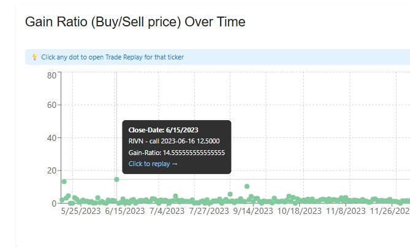
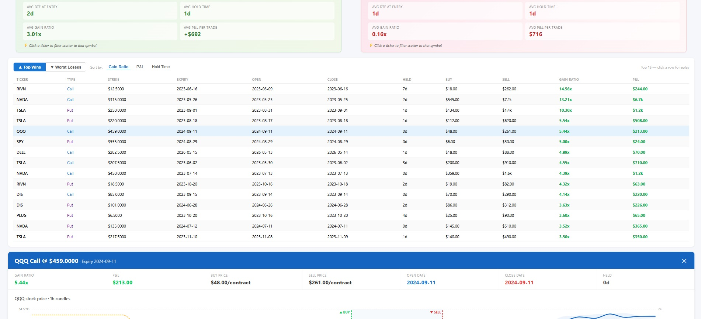
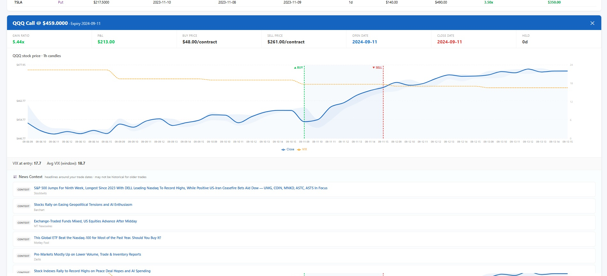
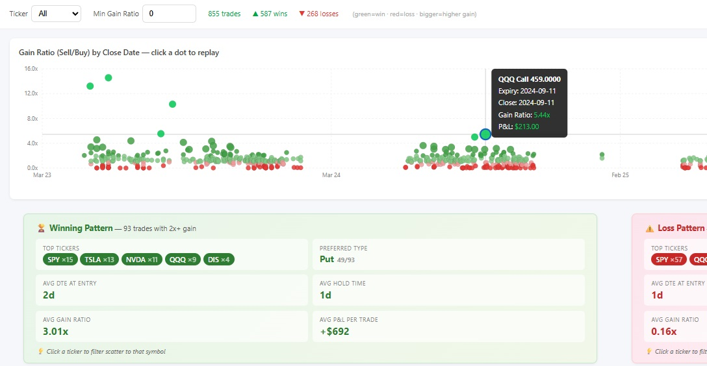
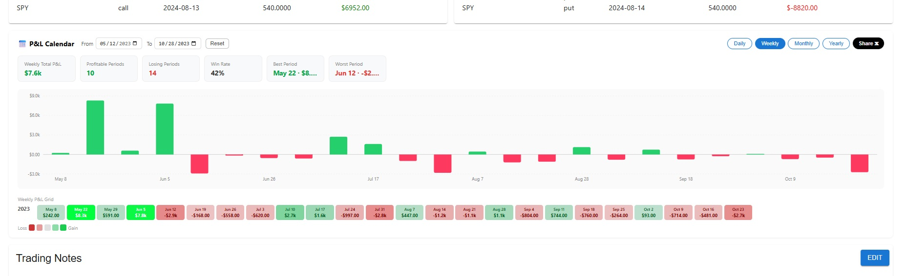
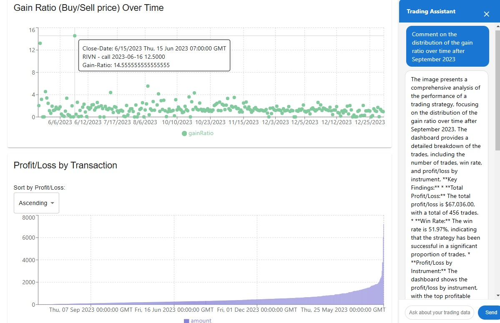

<div align="center">
  
  <h1>🚀 OptionScope 📊</h1>
  <h3>Robinhood Options Performance Dashboard</h3>
  <p><em>Elevate Your Options Trading with Data-Driven Insights</em></p>

  [](https://opensource.org/licenses/MIT)
  [](https://reactjs.org/)
  [](https://flask.palletsprojects.com/)

	
  


</div>


Supercharge your Robinhood options trading strategy with data-driven insights! 🚀
The **Options Trading Analysis Dashboard** is a powerful web application designed for options traders who want to understand and improve their trading performance. By securely fetching your options trading data directly from Robinhood, this dashboard provides in-depth analytics, interactive visualizations, and a platform for you to reflect, take notes, and develop better trading strategies.


Whether you're a seasoned options trader or just getting started, this tool helps you:

- Analyze your trading history in detail.
- Visualize profit and loss trends over time.
- Identify your most profitable instruments and strategies.
- Keep track of your thoughts and strategies with integrated note-taking.


## 🌟 Features

___

**🔮 Update — Trade Replay**

> Click any dot on the Gain Ratio scatter (or the 🔄 button) to open the Trade Replay panel.

  <div style="text-align: center;" align="center">
      <p></p>
      
    </div>


Learn *why* your best trades worked — and why your worst trades failed — by replaying any closed position against the stock chart with your exact buy and sell timestamps marked.

  <div style="text-align: center;" align="center">
      <p></p>
      
    </div>

  <div style="text-align: center;" align="center">
      <p></p>
      
    </div>

  <div style="text-align: center;" align="center">
      <p></p>
      
    </div>

**What Trade Replay shows you:**

- **Stock price chart** at the finest available granularity (5-minute candles for recent trades, 1-hour for older ones) spanning your entire hold period — with ▲ BUY and ▼ SELL lines marked
- **High-Low shaded band** so you can see the full daily price range, not just close
- **VIX overlay** on the right axis — see if you entered when volatility (premium) was cheap or expensive
- **Win/Loss Fingerprint** — side-by-side comparison of your 2x+ gain trades vs your worst losses, showing top tickers, preferred option type, average DTE at entry, average hold time, and average P&L
- **Top 15 wins and losses table** — sortable by gain ratio, P&L, or hold time; click any row to replay that trade
- **Similar trades** — instantly see all your other positions on the same ticker and option type, with their outcomes
- **News context** — Yahoo Finance headlines for that ticker around your trade dates
- **Trade Journal** — four structured prompts (thesis, entry signal, exit reason, lessons) saved locally per trade so you can build a personal playbook over time

**Key insight the fingerprint reveals:** your winning pattern (2DTE short puts on TSLA/NVDA) vs your losing pattern (0DTE SPY puts) — the DTE difference is often the single biggest variable separating wins from losses.

___

**🔮 Update — P&L Calendar**

Daily, weekly, monthly, and yearly P&L grids with green/red cells and dollar amounts. Click the view tabs above the bar chart to switch. Share any period on X with one click.

 <div style="text-align: center;" align="center">
      <p></p>
      
    </div>
___

**🔮 Update — Chatbot**
- **Chatbot Integration**: Interact with a chatbot to get quick answers and assistance on using the dashboard. Knows your data & plots.
  - Supports **Anthropic Claude**, **OpenAI GPT-4o**, and **OpenRouter** (free Llama models) — switch providers and paste your API key directly in the chat UI
  - Screenshots stored locally in `backend/screenshots` folder.
  <div style="text-align: center;" align="center">
      <p></p>
      
    </div>
___

- 📈 **Secure Data Fetching**: Log in with your Robinhood credentials to fetch your options trading history within a specified date range.
- 🏆 **Comprehensive Analytics**:
  - **Total Profit/Loss** calculations.
  - **Win Rate** and **Total Trades** overview.
  - **Profit/Loss by Instrument**: Identify which assets are driving your performance.
  - **Profit/Loss by Option Type**: Understand whether calls or puts are more profitable for you.
  - **Revenue Analysis by Instrument**.
  - **Cumulative Profit/Loss Over Time**: See how your P/L evolves.
  - **Top Profitable and Loss-Making Trades**: Learn from your best and worst trades.
- 📊 **Interactive Visualizations**: Utilize charts and graphs powered by Recharts for an intuitive analysis experience.
- 🗓️ **Customizable Date Range**: Focus your analysis on specific periods to see how strategies performed over time.
- 📝 **Trading Notes**:
  - Integrated note-taking section with Markdown support.
  - Export notes as Markdown files.
  - Save and load notes for continuous strategizing and refer back when needed.
- 💾 **CSV Upload Option**: Alternatively, upload your trading data via CSV if you prefer not to connect your Robinhood account.
- 💹 **Responsive Design**: Access the dashboard from desktop or mobile devices.


┌────────────────────────────────────────────────────────────────┬────────┐
│                            Feature                             │ Status │
├────────────────────────────────────────────────────────────────┼────────┤
│ Scatter (855 trades, green/red, size-scaled)                   │ ✅     │
├────────────────────────────────────────────────────────────────┼────────┤
│ Win + Loss Fingerprint side-by-side                            │ ✅     │
├────────────────────────────────────────────────────────────────┼────────┤
│ Top 15 wins/losses table (sortable, clickable rows)            │ ✅     │
├────────────────────────────────────────────────────────────────┼────────┤
│ Stock chart — adaptive granularity (5m for recent, 1d for old) │ ✅     │
├────────────────────────────────────────────────────────────────┼────────┤
│ High-Low shaded band + Close line                              │ ✅     │
├────────────────────────────────────────────────────────────────┼────────┤
│ VIX overlay + context interpretation                           │ ✅     │
├────────────────────────────────────────────────────────────────┼────────┤
│ BUY/SELL reference line markers                                │ ✅     │
├────────────────────────────────────────────────────────────────┼────────┤
│ News context (current headlines, bucketed entry/exit/context)  │ ✅     │
├────────────────────────────────────────────────────────────────┼────────┤
│ Similar trades table (same ticker+type, clickable)             │ ✅     │
├────────────────────────────────────────────────────────────────┼────────┤
│ Trade Journal (4 prompts, per-trade localStorage)              │ ✅     │
├────────────────────────────────────────────────────────────────┼────────┤
│ Auto-load on mount when credentials are cached                 │ ✅     │
├────────────────────────────────────────────────────────────────┼────────┤
│ Ticker chip click → filter scatter                             │ ✅     │
└────────────────────────────────────────────────────────────────┴────────┘


### Prerequisites

- **Node.js** (v14 or higher) -> 18.12.1
- **Python** (v3.6 or higher)
- **Robinhood Account Credentials**


## 🚀 Quick Start

1. Clone the repository:
   ```
   git clone git@github.com:Manojbhat09/optionscope.git
   ```

2. Install dependencies:
   ```
   cd optionscope
   pip install -r backend/requirements.txt
   npm run build
   npm install # make sure to use correct nodejs, 'nvm use 18.12.1' & 'npm audit --fix' 
   ```

3. Start the development server:
   ```
   npm start
   ```

4. Open your browser and navigate to `http://localhost:3000`


## 🚀 Elaborate Installing and Running the Flask Python Backend

**Prerequisites:**
- Python 3.7+ should be installed
- Pip (Python package manager) should be available

**Steps:**

1. **Clone or Copy the Code**
   - Place the backend code (the files you showed) in a directory on your machine.

2. **Create a Virtual Environment** (recommended):
   ```bash
   python3 -m venv venv
   source venv/bin/activate  # On Windows: venv\Scripts\activate
   ```

3. **Install Python Dependencies:**
   - You need to install Flask, Flask-CORS, pandas, numpy, robin_stocks, yfinance, python-dotenv, tqdm, pillow, requests (and possibly others).  
   - The simplest way is to create a `requirements.txt` file or just run:
     ```bash
     pip install flask flask-cors pandas numpy yfinance robin_stocks python-dotenv tqdm pillow requests
     ```
   - If you already have a `requirements.txt` file, use:
     ```bash
     pip install -r requirements.txt
     ```

4. **Set Up Environment Variables:**  
   - Create a `.env` file in your backend directory with the required variables, e.g.:
     ```
     REACT_APP_OPENROUTER_API_KEY=your_api_key_here
     ```
   - Replace `your_api_key_here` with your real key.
   - Or use export and put in ~/.bashrc
     ```
     export REACT_APP_OPENROUTER_API_KEY=sk-
     ```

5. **Run the Flask App:**
   ```bash
   cd backend
   python app.py
   ```
   - The server will run on `http://127.0.0.1:5000/` by default.

---

## 🟢 Using with Node.js (e.g., React, Next.js Frontend)

If you use `nvm` (Node Version Manager), you can update as follows:

```bash
nvm install --lts
nvm use --lts
node -v   # Should show v18.x, v20.x, etc.
```

Or, to get a specific version (example: v20):

```bash
nvm install 20
nvm use 20
```

- You do **not** "install" Python code with Node. Instead, you run your backend and frontend separately, and connect them via HTTP APIs.
- You can set up a Node.js frontend (React, Next.js, etc) in a separate folder, and call your Flask backend at `http://localhost:5000/api/...` endpoints.
    - For creating a React app:
      ```bash
      npx create-react-app frontend
      cd frontend
      npm start
      ```
    - Then, fetch data from your Flask backend using AJAX/fetch/axios in your React code.

---

## 🔗 Summary Table

| Part        | How to install/run                | Notes                                     |
|-------------|----------------------------------|-------------------------------------------|
| Flask Backend | `pip install ...` then `python app.py` | Python 3, use a virtualenv, set .env      |
| Node Frontend | `npm install`, `npm start` (if using) | Kept separate; frontend calls backend API |

---


## 🖥️ Usage

### Fetching Data from Robinhood

1. **Enter Credentials**:

   - **Username**: Your Robinhood account email.
   - **Password**: Your Robinhood account password.
   - **Start Date**: The beginning date for your trading data.
   - **End Date**: The ending date for your trading data.

2. **Fetch Data**:

   - Click the **"Fetch Data"** button.
   - The app will securely authenticate with Robinhood and retrieve your options trading history.

### Analyzing Your Trades

Once data is fetched:

- **Summary Overview**:

  - **Total Profit/Loss**: Net earnings from your trades.
  - **Total Profit**: Sum of all profitable trades.
  - **Total Loss**: Sum of all losing trades.
  - **Win Rate**: Percentage of trades that were profitable.
  - **Total Trades**: Number of trades made.

- **Charts and Graphs**:

  - **Profit/Loss by Instrument**: Bar chart showing P/L for each traded instrument.
  - **Revenue by Instrument**: Understand which instruments generate the most revenue.
  - **Profit/Loss by Option Type**: Pie chart comparing calls vs. puts.
  - **Cumulative Profit/Loss Over Time**: Line chart of your P/L progression.
  - **Holding Period Analysis**: Insights into the duration of your trades.

- **Top Trades**:

  - **Top Profitable Trades**: Review your best trades.
  - **Top Loss-Making Trades**: Identify and learn from your biggest losses.

### Reviewing Individual Trades

Scroll down to view a detailed table containing all your trades, including:

- Activity Date
- Instrument
- Description
- Transaction Code
- Quantity
- Strike Price
- Price
- Amount

### Trading Notes

- **Edit Notes**:

  - Click on **"Edit"** to modify your trading notes.
  - Notes support **Markdown** formatting for rich text features.

- **Save Notes**:

  - After editing, click **"Save"** to store your notes locally.

- **Export Notes**:

  - Click **"Export as MD"** to download your notes as a Markdown file.

- **Reset or Clear Notes**:

  - **Reset to Default**: Restore the original sample notes.
  - **Clear Notes**: Remove all notes.

### Adjusting Data Range

- Use the **row sliders** to adjust the range of data analyzed.
- Date range and row numbers are displayed for clarity.

### Uploading CSV Data (Optional)

- Click on **"Upload CSV"** to select and upload a CSV file containing your trading data.
- The CSV should have columns similar to those fetched from Robinhood.

## Security Notice

- **Credentials Usage**:

  - Your Robinhood **username and password** are used **only** to fetch your trading data.
  - **Credentials are not stored** on any server or sent to any third party.
  - Data fetching happens over secure connections directly with Robinhood's API.

- **Data Privacy**:

  - All fetched data is processed locally on your machine.
  - No trading data is uploaded or stored externally.

- **Important**:

  - Always ensure you **trust the application** before entering your credentials.
  - **Review the source code** if in doubt, particularly `backend/app.py` and `backend/get_rh_options_app.py`.


## 🔮 Future Features

We're constantly working to improve the Options Trading Analysis Dashboard. Here are some exciting features on our roadmap:

- 🤖 AI-powered trade recommendations based on historical performance
- 🌐 Integration with multiple brokers beyond Robinhood
- 📱 Mobile app for on-the-go analysis
- 🔔 Real-time alerts for potential profit-taking or loss-cutting opportunities
- 🧠 Machine learning models to predict option price movements
- 🗂️ Custom tagging system for categorizing and filtering trades
- 🔄 Backtesting functionality to simulate strategies on historical data
- 👥 Social features to share and compare trading strategies (anonymously)

## Roadmap

- **Integration with Other Brokers**: Support for TD Ameritrade, E*TRADE, etc.
- **Advanced Analytics**: Add more metrics like Sharpe ratio, volatility analysis.
- **Real-Time Data**: Incorporate live data feeds for real-time strategy testing.
- **Cloud Deployment**: Options to deploy the dashboard on cloud platforms.

## 🤝 Contributing

We welcome contributions from the community! If you'd like to contribute, please:

1. Fork the repository
2. Create a new branch for your feature
3. Commit your changes
4. Push to your branch
5. Open a pull request

- **Bug Reports & Feature Requests**: Open an issue on GitHub.
- **Pull Requests**: Feel free to fork the repository and submit pull requests.
- **Feedback**: Your feedback helps improve the tool for everyone.


## 📜 License

This project is licensed under the MIT License - see the [LICENSE](LICENSE) file for details.

## 🙏 Acknowledgements

- [Robinhood API](https://github.com/robinhood-unofficial/pyrh) for providing access to trading data
- [React](https://reactjs.org/) for the frontend framework
- [Flask](https://flask.palletsprojects.com/) for the backend server
- [Recharts](https://recharts.org/) for beautiful, responsive charts

---

Happy trading! 📈💰 May your options always be in the money!


