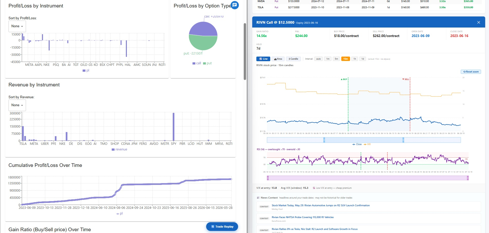
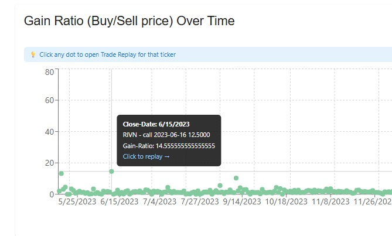
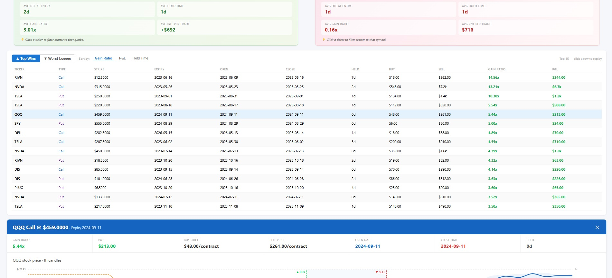
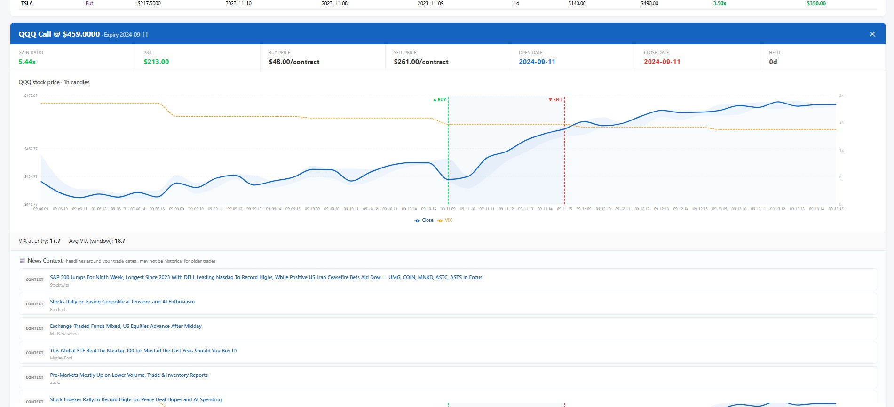
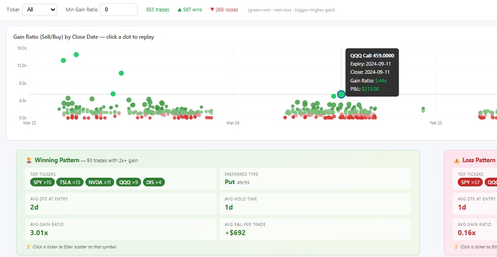
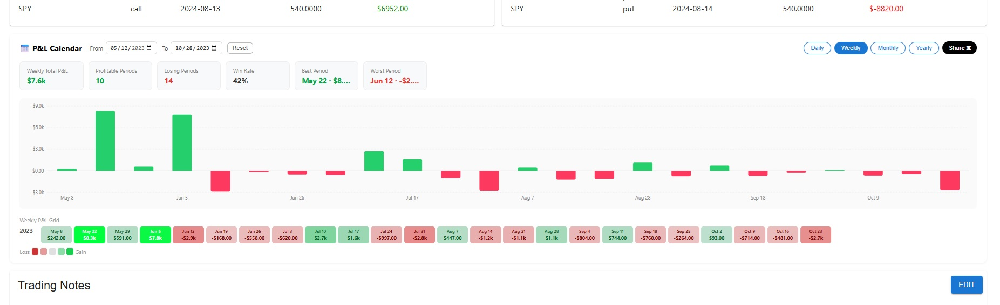

<div align="center">
  
  <h1>🚀 OptionScope 📊</h1>
  <h3>Robinhood options performance dashboard · trade replay · AI spot-analysis · built-in AI assistant</h3>
  <p><em>Elevate Your Options Trading with Data-Driven Insights</em></p>

  [](https://opensource.org/licenses/MIT)
  [](https://reactjs.org/)
  [](https://flask.palletsprojects.com/)
  [](https://www.electronjs.org/)
  [](skills/optionscope-app/SKILL.md)

  <p><em>Quantitative research tooling. Not financial advice.</em></p>

  
  <div style="text-align: center;" align="center">
      <p></p>
      
    </div>

</div>


Supercharge your Robinhood options trading strategy with data-driven insights! 🚀
The **Options Trading Analysis Dashboard** is a powerful web application designed for options traders who want to understand and improve their trading performance. By securely fetching your options trading data directly from Robinhood, this dashboard provides in-depth analytics, interactive visualizations, and a platform for you to reflect, take notes, and develop better trading strategies.
It runs **100% locally** — your credentials and API keys stay in your browser (or a local `.env`), the Flask backend talks only to Robinhood/market-data providers from your machine, and nothing is uploaded anywhere.

Whether you're a seasoned options trader or just getting started, this tool helps you:

- Analyze your trading history in detail.
- Visualize profit and loss trends over time.
- Identify your most profitable instruments and strategies.
- Keep track of your thoughts and strategies with integrated note-taking.

| Surface | What it answers |
|---|---|
| **📊 Dashboard** | *How am I doing overall?* — P/L stats, gain-ratio scatter, calendars, fingerprints |
| **⏮ Trade Replay** | *Why did THIS trade work or fail?* — any closed position replayed on its stock chart |
| **🎯 Spot Replay** | *What should I do with THIS open position?* — live edge analysis for a position you hold today |
…all wrapped by a **persistent AI assistant** that can see every page, and an **MCP server** that lets external AI agents drive the app.

## 📸 Screenshots

> **Placeholder — drop screenshots here** (suggested captures listed per section below)

| # | Suggested capture | File to add |
|---|---|---|
| 1 | Dashboard, night theme, loaded account | `public/shot-dashboard-night.png` `public/shot-dashboard-day.png`  |
| 2 | Trade Replay single trade w/ chart + news | `public/shot-trade-replay.png` |
| 3 | Multi-select toolbar + per-ticker cards | `public/shot-multiselect.png` |
| 4 | Spot Replay report | `public/spotreplay1.jpg` `public/spotreplay2.jpg` `public/spotreplay3.jpg`  |
| 5 | Settings Center → Preferences | `public/shot-settings.png` |
| 6 | AI assistant sidebar over the dashboard | `public/shot-assistant.png` `public/thinking.jpg` `public/thinking2.jpg` `public/thinking3.jpg` `public/thinking4.jpg` |

## 🌟 Features


## 📊 Dashboard

<!-- PLACEHOLDER: screenshot — dashboard with stat cards + scatter (public/shot-dashboard-night.png) -->

- **Stat cards** — total P/L, profit, loss, trade count, win rate (night-mode safe, configurable decimals/compact format).
- **Gain Ratio scatter** — every closed trade by close date vs sell/buy ratio. Plain click opens Trade Replay; **Ctrl/Cmd+click** (or the **Multi-select** toggle) builds a selection.
- **Cumulative P/L over time** — with **Single-plot** (one line per ticker + overall) and **Multi-ticker** (stacked per-ticker charts) layouts.
- **Top Profitable / Loss-Making tables** — scrollable, with a **Limit** input (default 100) to list as many tops as you want.
- **P&L calendar** — month grid of daily/period P&L with shareable summary.
- **Stock Price & Option Transactions** — overlay any ticker's price around a chosen date window.
- **Trading Notes** — collapsible how-to/playbook strip shared across all three pages.

## ⏮ Trade Replay

<!-- PLACEHOLDER: screenshot — replayed trade with buy/sell lines + VIX (public/shot-trade-replay.png) -->

Click any dot (or a row in the top-trades table) to replay that position against its stock chart:

- **Stock chart** with ▲ BUY / ▼ SELL lines at the exact timestamps, hold-period shading, **VIX overlay** (right axis), RSI panel, and drag-zoom.
- **Line / Area / Candle** modes · **Interval** picker (auto/1m/5m/15m/1h/1d) with automatic degradation notices when a provider can't serve the requested grain.
- **News context** for the ticker around the hold window.
- **Trade Journal** — four structured prompts per trade (thesis, entry signal, exit reason, lessons), saved locally.
- **Win/Loss fingerprints** — always-visible side-by-side cards (2x+ gainers vs >50% losers): top tickers, option type, avg DTE, avg hold, avg P&L.

### 🆕 Multi-select & Price-Action charts

<!-- PLACEHOLDER: screenshot — orange selection toolbar + per-ticker cards (public/shot-multiselect.png) -->

- **Select many trades**: flip the **Multi-select** button on the Gain Ratio card (or just **Ctrl+click** dots any time).
- An **orange toolbar** appears: `n selected · ▲W ▼L · P&L` with **Clear** — and the whole page reflects the selection: pattern cards show a `SELECTED n` badge, counts switch to the subset, and everything recomputes instantly (pure client-side).
- **Selected Trades · Price Action** charts, two exclusive layouts:
  - **Single-plot** — one chart, a line per ticker (% change when several tickers, raw close for one) + trade markers + VIX + **RSI when exactly one ticker is selected**.
  - **Multi-ticker** — **one separate card per ticker**, each with a per-trade detail table (Gain Ratio · P&L · Buy/Sell $/contract · Buy/Sell time · Held), its own chart (Line/Area/Candle), VIX overlay, RSI panel and drag-zoom.
- **Day-trade aware**: selections containing same-day trades automatically fetch 1m/5m/15m candles so ▲/▼ markers don't collapse onto one daily bar, and all timestamps display seconds.

**What this helps with:** tag your best breakout plays and your worst chases, then compare their charts side by side — per-ticker cards make it obvious whether your losers share an entry pattern (e.g. buying the first red candle) that single-trade replay hides.

## 🎯 Spot Replay

<!-- PLACEHOLDER: screenshot — Spot Replay report (public/shot-spot-replay.png) -->

A dynamic **options-edge analyzer** for a position you hold *right now*:

1. **Paste your position** (ticker, strike, expiry, cost, current price — a pre-filled example is ready to run) or fill the form; optionally attach a chart screenshot for the vision model.
2. Hit **Run Analysis** — an agent pipeline fetches market data, runs web research (DuckDuckGo), Monte-Carlo simulation, ML forecasts (Gradient Boosting / Random Forest / ARIMA) and renders a full report: probability of ITM, probability of profit, **hold-vs-sell expected values**, Kelly fraction, regime table and a final recommendation.
3. Your last inputs are remembered; the LLM provider/model is configurable per-surface.

**What this helps with:** replaces gut-feel "should I close this?" with expected-value math — hold EV vs sell EV per contract, plus the probability the position finishes in the money.

## 🤖 AI assistant (built in)

<!-- PLACEHOLDER: screenshot — assistant sidebar (public/shot-assistant.png) -->

- Persistent sidebar (`Ctrl+/`) that survives navigation and **sees the active page's context** — stats, tables, the replayed trade, or the Spot Replay verdict.
- Streaming responses, web search toggle, per-surface provider/model/timeout, chat history with export/clear/retention.
- Any provider key you paste works everywhere: Anthropic, OpenAI, OpenRouter, InferX, Z.ai, CommandCode, or a **custom/local endpoint** (Ollama, LM Studio, vLLM).

## 🧩 MCP — let external agents drive the app

OptionScope ships an **MCP server** (`backend/mcp_server.py`) + agent bridge so Claude Desktop / any MCP client can: navigate pages, read full UI state, take screenshots, query trades and run analysis — see [`skills/optionscope-app/SKILL.md`](skills/optionscope-app/SKILL.md).

- Toggle it in **Setup → Preferences → MCP / agent control** (loopback-only by default; LAN exposure is opt-in and applies next launch).
- Optional **screenshot redaction** masks login/password fields before an agent ever sees them.

## ⚙️ Settings Center (gear → Setup)

Everything lives in four tabs — no `.env` editing required:

| Tab | Contents |
|---|---|
| **Account & Data** | Robinhood login + default date range |
| **AI Providers** | all provider keys + custom/local endpoint (shared by assistant & Spot Replay) |
| **Preferences** | everything below ↓ |
| **About** | where data lives, shortcuts |

**Preferences:**

- **Appearance** — Day / Night / **Auto** (night theme 19:00–07:00 local, hands-free).
- **Data & startup** — remember Robinhood login after a successful fetch · auto-load trades on launch · default date-range lookback (days) · chart data source (auto vs force-yfinance).
- **Analysis defaults** — remember filters between sessions · P/L decimal places · compact thousands.
- **Assistant & AI** — temperature · max tokens · web-research default · chat history retention + export/clear.
- **MCP / agent control** — enable switch · allow LAN · screenshot redaction.
- **Env-file persistence** — write settings to `backend/.env` on save, and/or use `.env` values as defaults on next startup (manual `.env` entries are preserved).
- **Market data** — Alpaca key/secret + Polygon key (shared with Trade Replay charts/news).
- **Danger zone** — one-click wipe of all local data.

## 🌗 Day / night theme

The header button cycles **Day → Night → Auto**. One `<html data-theme>` attribute drives every surface, including dialogs and charts.


___

**🔮 Update — Trade Replay**

> Click any dot on the Gain Ratio scatter (or the 🔄 button) to open the Trade Replay panel.

  <div style="text-align: center;" align="center">
      <p></p>
      
    </div>


Learn *why* your best trades worked — and why your worst trades failed — by replaying any closed position against the stock chart with your exact buy and sell timestamps marked.

  <div style="text-align: center;" align="center">
      <p></p>
      
    </div>

  <div style="text-align: center;" align="center">
      <p></p>
      
    </div>

  <div style="text-align: center;" align="center">
      <p></p>
      
    </div>

**What Trade Replay shows you:**

- **Stock price chart** at the finest available granularity (5-minute candles for recent trades, 1-hour for older ones) spanning your entire hold period — with ▲ BUY and ▼ SELL lines marked
- **High-Low shaded band** so you can see the full daily price range, not just close
- **VIX overlay** on the right axis — see if you entered when volatility (premium) was cheap or expensive
- **Win/Loss Fingerprint** — side-by-side comparison of your 2x+ gain trades vs your worst losses, showing top tickers, preferred option type, average DTE at entry, average hold time, and average P&L
- **Top 15 wins and losses table** — sortable by gain ratio, P&L, or hold time; click any row to replay that trade
- **Similar trades** — instantly see all your other positions on the same ticker and option type, with their outcomes
- **News context** — Yahoo Finance headlines for that ticker around your trade dates
- **Trade Journal** — four structured prompts (thesis, entry signal, exit reason, lessons) saved locally per trade so you can build a personal playbook over time

**Key insight the fingerprint reveals:** your winning pattern (2DTE short puts on TSLA/NVDA) vs your losing pattern (0DTE SPY puts) — the DTE difference is often the single biggest variable separating wins from losses.

___

** Update - Cache policy**

````text
New files:
- backend/cache_store.py — CacheStore/FileCacheStore: atomic writes (temp file + os.replace), corrupt-file-safe reads, TTL support via age_seconds(). The one storage implementation both caches now use.
- backend/range_cache.py — RangeCoverageCache: the single, tested implementation of "is [start,end] actually covered, or do I need to fetch, and from where." This is what replaces the two independently-buggy coverage checks.

backend/get_rh_options_app.py — full rewrite:
- Collapsed the old dual pickle+CSV cache into one coverage-tracked cache entry per account, namespaced by a hash of the username (fixes the "single global file, accounts collide" issue).
- Added incremental sync: when the cache already reaches back far enough but is stale (>5min TTL), it now fetches only from the last-synced date forward instead of re-pulling all 38 pages every time.
- Fixed the log message that would've claimed "cache covers X" even during a full backfill.
- delete_cache and /api/clear-cache now take username and clear the right account's entry specifically.

backend/app.py — stock-history cache:
- Moved onto FileCacheStore (atomic writes).
- Fixed the interval key/content mismatch: TTL is now chosen from the actual granularity stored in the payload, not the one merely requested — so a 1m request that fell back to 1d data correctly gets the 1d TTL bucket instead of being treated as stale every 5 minutes.
- Removed the unconditional backup/ snapshot-per-fetch (was pure unbounded disk growth, already 9.5MB from local testing alone).

Measured speedup (real account, real Robinhood API):

┌─────────────────────────────────────┬────────────────────┬──────────────────────────────────────────────┐
│              Scenario               │       Before       │                    After                     │
├─────────────────────────────────────┼────────────────────┼──────────────────────────────────────────────┤
│ Cold fetch (2023→now, full history) │ ~46-82s            │ ~46-72s (unavoidable — Robinhood pagination) │
├─────────────────────────────────────┼────────────────────┼──────────────────────────────────────────────┤
│ Repeat fetch, same range            │ ~46-82s every time │ 1.2s                                         │
├─────────────────────────────────────┼────────────────────┼──────────────────────────────────────────────┤
│ Narrower range within cache         │ ~46-82s every time │ 0.45s                                        │
├─────────────────────────────────────┼────────────────────┼──────────────────────────────────────────────┤
│ Stale-but-covered refresh           │ full re-pull       │ incremental sync, <1s                        │
├─────────────────────────────────────┼────────────────────┼──────────────────────────────────────────────┤
│ /api/clear-cache + refetch          │ —                  │ works correctly, scoped to account           │
└─────────────────────────────────────┴────────────────────┴──────────────────────────────────────────────┘

Also fixed: .gitignore now excludes backend/orders_cache/, backend/stock_cache/, backend/backup/, backend/__pycache__/ — none of these are runtime cache state that belongs in version control.

One thing I did not touch, flagging for you to decide: backend/orders.csv is currently tracked in git (git ls-files confirms it) and contains your real trade history — dates, tickers, amounts. It's now unused (superseded by backend/orders_cache/), but I didn't remove it from version control since that touches git history/tracked state, which needs your sign-off. If you want it out: git rm --cached backend/orders.csv untracks it going forward (keeps your local copy) — note it'd still exist in past commits unless you also rewrite history, which is a separate, more invasive step.
````

___

**🔮 Update — P&L Calendar**

Daily, weekly, monthly, and yearly P&L grids with green/red cells and dollar amounts. Click the view tabs above the bar chart to switch. Share any period on X with one click.

 <div style="text-align: center;" align="center">
      <p></p>
      
    </div>
___

**🔮 Update — Chatbot**
- **Chatbot Integration**: Interact with a chatbot to get quick answers and assistance on using the dashboard. Knows your data & plots.
  - Supports **Anthropic Claude**, **OpenAI GPT-4o**, and **OpenRouter** (free Llama models) — switch providers and paste your API key directly in the chat UI
  - Screenshots stored locally in `backend/screenshots` folder.
___

- 📈 **Secure Data Fetching**: Log in with your Robinhood credentials to fetch your options trading history within a specified date range.
- 🏆 **Comprehensive Analytics**:
  - **Total Profit/Loss** calculations.
  - **Win Rate** and **Total Trades** overview.
  - **Profit/Loss by Instrument**: Identify which assets are driving your performance.
  - **Profit/Loss by Option Type**: Understand whether calls or puts are more profitable for you.
  - **Revenue Analysis by Instrument**.
  - **Cumulative Profit/Loss Over Time**: See how your P/L evolves.
  - **Top Profitable and Loss-Making Trades**: Learn from your best and worst trades.
- 📊 **Interactive Visualizations**: Utilize charts and graphs powered by Recharts for an intuitive analysis experience.
- 🗓️ **Customizable Date Range**: Focus your analysis on specific periods to see how strategies performed over time.
- 📝 **Trading Notes**:
  - Integrated note-taking section with Markdown support.
  - Export notes as Markdown files.
  - Save and load notes for continuous strategizing and refer back when needed.
- 💾 **CSV Upload Option**: Alternatively, upload your trading data via CSV if you prefer not to connect your Robinhood account.
- 💹 **Responsive Design**: Access the dashboard from desktop or mobile devices.

| Feature | Status |
|---|---|
| Scatter plot with 855 trades, green/red coloring, and size scaling | ✅ Complete |
| Win/Loss fingerprint view shown side-by-side | ✅ Complete |
| Top 15 wins/losses table with sorting and clickable rows | ✅ Complete |
| Stock chart with adaptive granularity (5m for recent trades, 1d for older trades) | ✅ Complete |
| High-Low shaded band with Close price line | ✅ Complete |
| VIX overlay with contextual interpretation | ✅ Complete |
| BUY/SELL reference line markers | ✅ Complete |
| News context with entry, exit, and broader trade bucketization | ✅ Complete |
| Similar trades table for same ticker and trade type | ✅ Complete |
| Trade Journal with 4 prompts and per-trade localStorage persistence | ✅ Complete |
| Auto-load on mount when cached credentials are available | ✅ Complete |
| Clickable ticker chips to filter the scatter plot | ✅ Complete |

---

### Prerequisites

- **Node.js** (v14 or higher) -> 18.12.1
- **Python** (v3.6 or higher)
- **Robinhood Account Credentials**


### 🗺 Navigation map

```
Dashboard (default)
 ├─ header: date range · Fetch Data · cache-clear · theme cycle · Setup ⚙ · assistant 💬
 ├─ stat cards → Gain Ratio scatter ──(click dot)──▶ Trade Replay
 ├─ Top tables · P&L calendar · Trading Notes
 ├─ floating ▸ Spot Replay (green) · ▸ Trade Replay (blue)
 │
Trade Replay
 ├─ controls row: dates · gear (Robinhood login) · Load Trades
 ├─ Gain Ratio scatter [Multi-select] → orange toolbar → Price-Action charts
 ├─ selected trade: KPI strip · chart (Line/Area/Candle · Interval · zoom) · VIX · RSI · News · Journal
 └─ Win/Loss fingerprints · top performers · Trading Notes
 │
Spot Replay
 ├─ paste block / form (pre-filled example) · chart screenshot · Run Analysis
 └─ agent activity log · report (MC · ML · EV hold/sell · decision matrix) · Trading Notes
```

### 🧱 Architecture

```
React (CRA) ──► Flask (backend/) ──► Robinhood API · yfinance · Alpaca · Polygon · LLM providers
     │                │
     │                ├─ agent_bridge.py  (SSE control plane)
     │                ├─ mcp_server.py    (MCP tool layer for external agents)
     │                ├─ chat_history.py  (append-only local chat log)
     │                └─ data/            (caches, chat log, agent settings)
     └─ localStorage (creds, keys, preferences — this device only)
```

- **Desktop**: Electron (`desktop/`) wraps the same UI and spawns the backend as a sidecar; tags `v*` build portable zips + installers via GitHub Actions.
- **Privacy**: credentials live in your browser; the backend only talks to Robinhood/market-data providers from your machine.

---

## 🚀 Quick start

### Option A — Desktop app (easiest)
1. Grab the installer for your OS from [Releases](https://github.com/Manojbhat09/optionscope/releases)
   (`OptionScope-Setup.exe` · `.dmg` · `.AppImage`/`.deb`).
2. Open it → click the **gear → Setup** → enter your Robinhood login → **Fetch Data**.
3. Done. The backend ships frozen inside the app; nothing else to install.

### Option B — Run from source (web app)
```bash
git clone https://github.com/Manojbhat09/optionscope && cd optionscope

# 1) backend  (Python 3.10+, deps in requirements.txt)
cd backend && pip install -r requirements.txt && flask run --port 5000

# 2) frontend (Node 18+)
cd .. && npm install && npm start          # dev server on :3000 (proxies API to :5000)

# production build instead:
npm run build && flask run                 # backend serves build/ at /Manojbhat09/optionscope
```

> Prefer zero-terminal? The **portable zip** in each Release contains the built web app +
> backend + `START_HERE.sh` / `START_HERE.bat` — unzip and double-click.

### First 5 minutes (new-user path)
1. **Setup** (gear, top right) → *Account & Data* → Robinhood login + date range → Save.
2. Dashboard → **Fetch Data**. Your order history is fetched once and cached locally.
3. Skim the stat cards → click any dot in the **Gain Ratio** scatter → you're in **Trade Replay**.
4. Open **Spot Replay** (green button, bottom-right) → paste an open position (or use the
   pre-filled example) → **Run Analysis**.
5. Press `Ctrl+/` to open the **AI assistant** — it can see whatever page you're on. Ask
   *"what's my worst losing pattern?"*.

---


## 🖥️ Usage

### Fetching Data from Robinhood

1. **Enter Credentials**:

   - **Username**: Your Robinhood account email.
   - **Password**: Your Robinhood account password.
   - **Start Date**: The beginning date for your trading data.
   - **End Date**: The ending date for your trading data.

2. **Fetch Data**:

   - Click the **"Fetch Data"** button.
   - The app will securely authenticate with Robinhood and retrieve your options trading history.

### Analyzing Your Trades

Once data is fetched:

- **Summary Overview**:

  - **Total Profit/Loss**: Net earnings from your trades.
  - **Total Profit**: Sum of all profitable trades.
  - **Total Loss**: Sum of all losing trades.
  - **Win Rate**: Percentage of trades that were profitable.
  - **Total Trades**: Number of trades made.

- **Charts and Graphs**:

  - **Profit/Loss by Instrument**: Bar chart showing P/L for each traded instrument.
  - **Revenue by Instrument**: Understand which instruments generate the most revenue.
  - **Profit/Loss by Option Type**: Pie chart comparing calls vs. puts.
  - **Cumulative Profit/Loss Over Time**: Line chart of your P/L progression.
  - **Holding Period Analysis**: Insights into the duration of your trades.

- **Top Trades**:

  - **Top Profitable Trades**: Review your best trades.
  - **Top Loss-Making Trades**: Identify and learn from your biggest losses.

### Reviewing Individual Trades

Scroll down to view a detailed table containing all your trades, including:

- Activity Date
- Instrument
- Description
- Transaction Code
- Quantity
- Strike Price
- Price
- Amount

### Trading Notes

- **Edit Notes**:

  - Click on **"Edit"** to modify your trading notes.
  - Notes support **Markdown** formatting for rich text features.

- **Save Notes**:

  - After editing, click **"Save"** to store your notes locally.

- **Export Notes**:

  - Click **"Export as MD"** to download your notes as a Markdown file.

- **Reset or Clear Notes**:

  - **Reset to Default**: Restore the original sample notes.
  - **Clear Notes**: Remove all notes.

### Adjusting Data Range

- Use the **row sliders** to adjust the range of data analyzed.
- Date range and row numbers are displayed for clarity.

### Uploading CSV Data (Optional)

- Click on **"Upload CSV"** to select and upload a CSV file containing your trading data.
- The CSV should have columns similar to those fetched from Robinhood.

## Security Notice

- **Credentials Usage**:

  - Your Robinhood **username and password** are used **only** to fetch your trading data.
  - **Credentials are not stored** on any server or sent to any third party.
  - Data fetching happens over secure connections directly with Robinhood's API.

- **Data Privacy**:

  - All fetched data is processed locally on your machine.
  - No trading data is uploaded or stored externally.

- **Important**:

  - Always ensure you **trust the application** before entering your credentials.
  - **Review the source code** if in doubt, particularly `backend/app.py` and `backend/get_rh_options_app.py`.


## 🔮 Future Features

We're constantly working to improve the Options Trading Analysis Dashboard. Here are some exciting features on our roadmap:

- 🌐 Integration with multiple brokers beyond Robinhood
- 📱 Mobile app for on-the-go analysis
- 🔔 Real-time alerts for potential profit-taking or loss-cutting opportunities
- 🔄 Backtesting functionality to simulate strategies on historical data
- 👥 Social features to share and compare trading strategies (anonymously)

## Roadmap

- **Integration with Other Brokers**: Support for TD Ameritrade, E*TRADE, etc.
- **Advanced Analytics**: Add more metrics like Sharpe ratio, volatility analysis.
- **Cloud Deployment**: Options to deploy the dashboard on cloud platforms.

## 🤝 Contributing

We welcome contributions from the community! If you'd like to contribute, please:

1. Fork the repository
2. Create a new branch for your feature
3. Commit your changes
4. Push to your branch
5. Open a pull request

- **Bug Reports & Feature Requests**: Open an issue on GitHub.
- **Pull Requests**: Feel free to fork the repository and submit pull requests.
- **Feedback**: Your feedback helps improve the tool for everyone.


## 📜 License

This project is licensed under the MIT License - see the [LICENSE](LICENSE) file for details.

## 🙏 Acknowledgements

- [Robinhood API](https://github.com/robinhood-unofficial/pyrh) for providing access to trading data
- [React](https://reactjs.org/) for the frontend framework
- [Flask](https://flask.palletsprojects.com/) for the backend server
- [Recharts](https://recharts.org/) for beautiful, responsive charts


## ⚠️ Disclaimer

OptionScope is quantitative research tooling for **your own** trading data. Nothing in it is
financial advice. Options trading involves substantial risk of loss.

---

Happy trading! 📈💰 May your options always be in the money!


